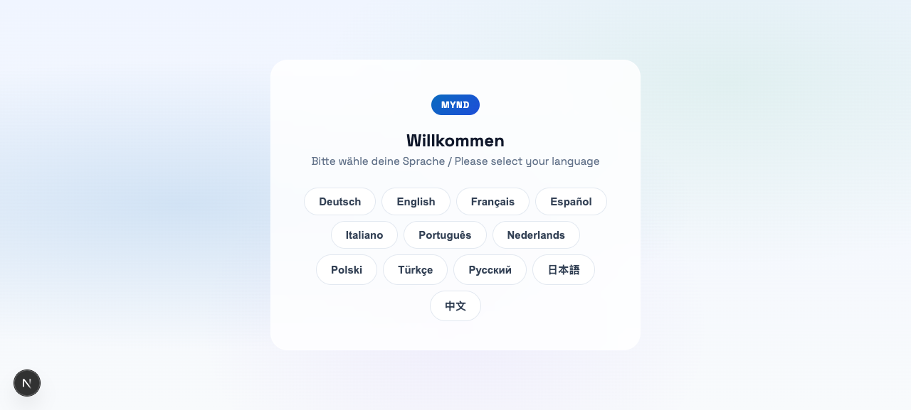
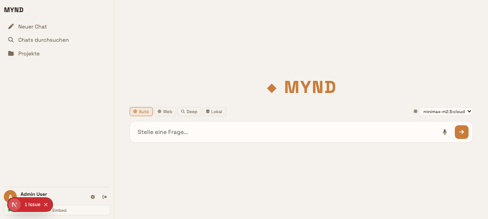
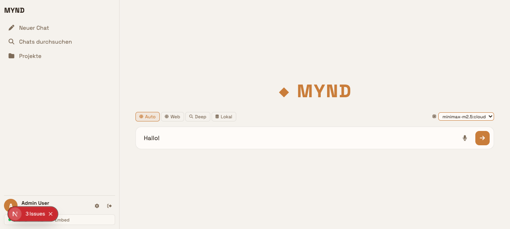

# 🧠 MYND

**Local-first AI workspace** — chat, search, automation, browser control, smart-home integrations, and sub-agent delegation with local storage and a configurable model provider.


<p align="center">
  
  
  
</p>

MYND combines a conversational AI agent with personal knowledge retrieval, file generation, photo search, smart-home control, automations, browser automation, and a plugin system. It can use a local Ollama model; cloud model providers and external integrations are optional and transmit data when enabled.

---

## ✨ Features

| | |
|---|---|
| **💬 Agentic Chat** | Streaming AI chat with tool-calling, multi-round planning, sub-agent delegation |
| **🧠 Knowledge Base** | Semantic search across your documents (Ollama embeddings) |
| **🌐 Web Research** | DuckDuckGo search, news aggregation, multi-source research |
| **🗺️ Browser Automation** | Headless Playwright + agent-browser CLI — [128 tools total](FEATURES.md) |
| **📷 Photo Search** | Semantic photo search via Immich |
| **🏠 Smart Home** | Home Assistant — lights, switches, sensors, cameras, scenes, scripts |
| **📅 Productivity** | CalDAV calendars & tasks (Nextcloud), timer reminders |
| **📧 Email** | IMAP/SMTP integration for reading & sending |
| **🤖 Automations** | Cron-based automations, daily briefing, scheduled actions |
| **🔌 Plugin System** | Extensible registry for repository-reviewed local plugins, toggle at runtime |
| **🔐 Vault** | Local credential storage for API keys, passwords, and integration configuration |
| **🛡️ Auth** | Password-based login, configurable registration, role-based access |
| **🎨 Themes** | 7 color themes × light/dark/modes |
| **🌐 Multi-language** | UI in 12 languages: DE, EN, FR, ES, IT, PT, NL, PL, TR, RU, JA, ZH |

> All 128 AI-callable tools are documented in **[FEATURES.md](FEATURES.md)**.

---

## 🚀 Quick Start

```bash
git clone https://github.com/SchBenedikt/mynd.git
cd mynd

# Install locked backend dependencies and frontend packages
make setup

# Optional: install Chromium for browser automation and smoke tests
uv run playwright install chromium

# Start both
make dev
```

Open **http://localhost:3000**. The API runs at `http://127.0.0.1:5001`.

On first launch, the setup wizard lets you create the initial admin password. MYND does not print or generate that password in the backend log.

---

## 📦 Requirements

- **Python** 3.12+
- **Node.js** 22+ / npm 10+
- **uv** — locked Python dependency management
- **Ollama** (optional) — for local embeddings & inference
- **Chromium via Playwright** (optional) — browser automation and smoke tests
- **bubblewrap** (Linux, recommended) — OS-level isolation for shell and Python tools

---

## 🏗️ Architecture

```
mynd/
├── app.py                  ← Backend entry point
├── app/                    ← Flask application, routes, auth, agent loop, scheduling
│   ├── routes.py           ← HTTP and SSE API routes
│   ├── agent_loop.py       ← Agent orchestration and tool execution loop
│   └── ollama_client.py    ← Ollama / OpenAI-compatible model client
├── core/                   ← Retrieval, model helpers, tools, vault, scheduler, plugins
│   ├── tools.py            ← Core tools: bash, ssh, web, memory, vault, delegate, plan, agent-browser
│   ├── vault.py            ← Local credential storage
│   ├── plugin_base.py      ← Plugin discovery & hot-reload
│   └── ...
├── data/                   ← Runtime data (gitignored): vault, configs, uploads
│   └── plugins/            ← Built-in integrations (Browser, HA, Nextcloud, Immich, …)
├── frontend/               ← Next.js 16 / React 19 application
│   ├── app/                ← Pages, layout, globals.css
│   ├── components/         ← Reusable UI components
│   │   └── BrowserPreview.js  ← Screenshot viewer in LiveTools
│   ├── hooks/              ← Custom React hooks
│   └── lib/                ← API fetch helpers, contexts
├── scripts/                ← Document sync & ingestion
└── tests/                  ← Backend pytest suite
```

### Data flow

```
Browser ──HTTP/SSE──> Flask API ──> Ollama / OpenAI
                              │
                              ├──> Knowledge Base (embeddings)
                              ├──> Tools (bash, ssh, web, files, …)
                              ├──> Browser (Playwright + agent-browser)
                              ├──> Plugins (HA, Nextcloud, Immich, …)
                              └──> Vault (local credentials)
```

For the complete tool reference, see **[FEATURES.md](FEATURES.md)**. Plugin authors should start with **[PLUGIN_DEV.md](PLUGIN_DEV.md)**.

---

## 💡 Usage Examples

```bash
# Start the system
make dev

# Then open http://localhost:3000 and try:
#   "Open spiegel.de and take a screenshot"
#   "What's in the news today?"
#   "Find the photo from last summer in Italy"
#   "Show me my calendar for this week"
#   "Compare server load between TrueNAS and Proxmox"
#   "Create a plan: backup Nextcloud, update all containers, send report"
```

---

## ⚙️ Configuration

### Environment Variables

| Variable | Purpose | Default |
|---|---|---|
| `OLLAMA_BASE_URL` | Ollama API endpoint | `http://127.0.0.1:11434` |
| `OLLAMA_MODEL` | Default chat model | `gemma3:latest` |
| `CORS_ALLOWED_ORIGINS` | Allowed frontend origins | `http://localhost:3000` |
| `NEXTCLOUD_URL` | Nextcloud instance URL | — |
| `NEXTCLOUD_USERNAME` | Nextcloud username | — |
| `NEXTCLOUD_PASSWORD` | Nextcloud app password | — |
| `MYND_WORKSPACE_DIR` | Allowed root for agent file tools | `./data/workspace` |
| `MYND_HTTP_ALLOW_PRIVATE_HOSTS` | Explicit allowlist for private HTTP targets | empty |
| `MYND_PERMISSION_MODE` | Privileged command confirmation policy (`ask`, `semi`, `auto`) | `ask` |
| `MYND_VAULT_KEY` | Optional Fernet key supplied by a secret manager | generated key file |
| `MYND_VAULT_KEY_FILE` | External vault-key file location | `~/.config/mynd/vault.key` |

Copy [.env.example](.env.example) to `.env` for the complete, commented configuration.

### Settings UI

Most configuration is available from the web UI:

- **AI Provider** — Ollama, OpenAI-compatible
- **Integrations** — Nextcloud, Home Assistant, Immich, Reolink, TrueNAS, Email
- **Theme** — 7 color themes, light/dark/auto
- **Users** — Registration toggle, role management
- **Indexing** — Document sync & embedding
- **Language** — 12 languages available

---

## 🧪 Development

```bash
make test              # Backend tests (pytest)
make lint              # Python lint (Ruff)
make frontend-lint     # Frontend lint (ESLint)
make security          # Bandit and dependency vulnerability audits
make typecheck         # Focused backend type checks
make check             # Full CI check
make clean             # Remove caches & build output
```

### Manual setup

```bash
uv sync --locked --extra dev
npm ci
npm ci --prefix frontend
uv run playwright install chromium   # optional, for browser automation
```

---

## 🛡️ Security & Privacy

### Data Locality

MYND is **local-first** in the sense that application state, credentials, files, and configuration are stored on the machine running MYND. It is not automatically offline: enabled providers and integrations intentionally communicate with external services.

| Feature | Data Sent | External Service |
|---|---|---|
| **Web Search** | Search query | DuckDuckGo |
| **News Fetch** | None (pulls RSS feeds) | Tagesschau, Heise, etc. |
| **Web Browsing** | Target URL | Requested websites |
| **AI Model** | Conversations | Configurable Ollama / OpenAI endpoint |
| **Email** | Credentials + messages | Your IMAP/SMTP server |
| **Smart Home** | API commands | Your Home Assistant instance |
| **Immich** | Search queries | Your Immich server |

> ⚠️ When using cloud-based AI providers (OpenAI, etc.), your conversation text is sent to their API. For full local operation, use Ollama with a local model.

### Security

- Passwords stored as **salted hashes** (werkzeug)
- Integration credentials encrypted at rest with **Fernet**; the key is stored outside the repository data directory
- **Role-based access** (admin / user)
- **Configurable registration** — disabled by default
- All `/api/` routes authenticated by default
- Configurable confirmation modes for privileged tools
- Workspace-restricted file access and optional bubblewrap sandboxing on Linux
- Audit log for all privileged tool calls (`data/audit.jsonl`)

> Existing plaintext vaults are encrypted automatically on first access. Back up the external vault key separately; losing it makes the encrypted vault unrecoverable.

> **Run only in a trusted environment.** MYND can execute shell commands, SSH into remote hosts, control smart home devices, and automate browsers.

---

## 📄 License

[MIT](LICENSE) — feel free to use, modify, and share.
